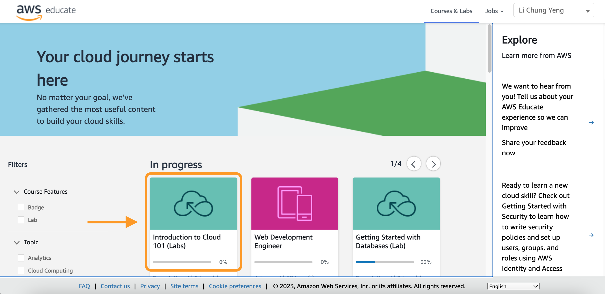
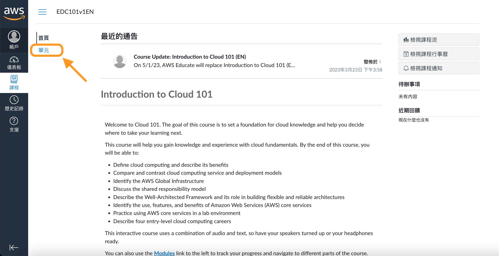
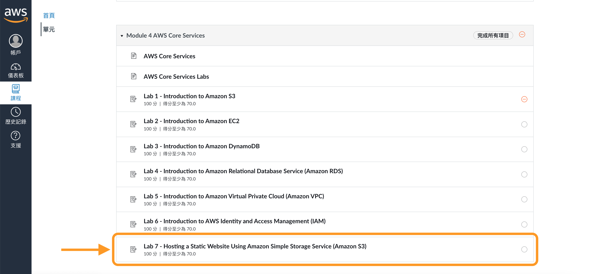
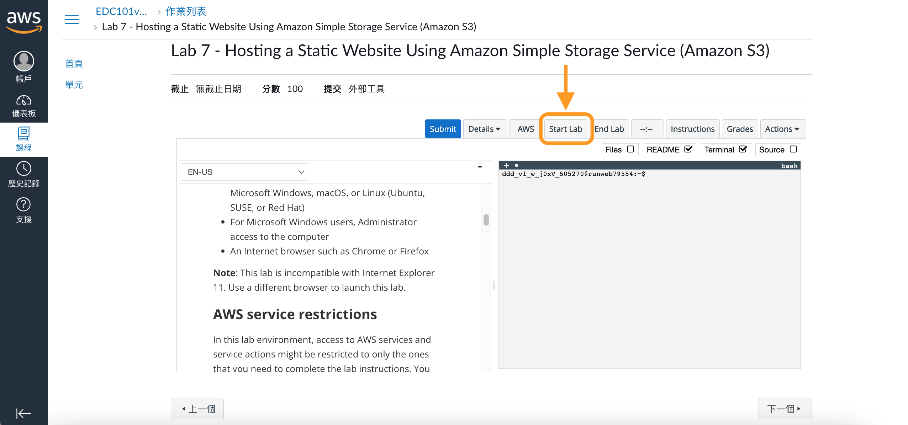

### AWS 校園大使 - 帶你使用爽用 AWS 雲服務
直播時間：4/27 (四) 20:00 ~ 21:00
校園大使：[Andy Lee](https://github.com/106207411), [Johnny Yeng](https://github.com/a2902793)

#### 前置作業
1. [註冊 AWS Educate](https://awseducate.tw/1)
2. 找到一個名為「Introduction to Cloud 101」的課程（[連結](https://awseducate.instructure.com/courses/746)）

3. 進到「單元」裡（[連結](https://awseducate.instructure.com/courses/746/modules)）

4. 找到「Module 4 AWS Core Services」之下的「Lab 7 - Hosting a Static Website Using Amazon Simple Storage Service (Amazon S3)」（[連結](https://awseducate.instructure.com/courses/746/assignments/3111?module_item_id=15080)）

5. 點選「Start Lab」建立功能受限之臨時 AWS 帳號
